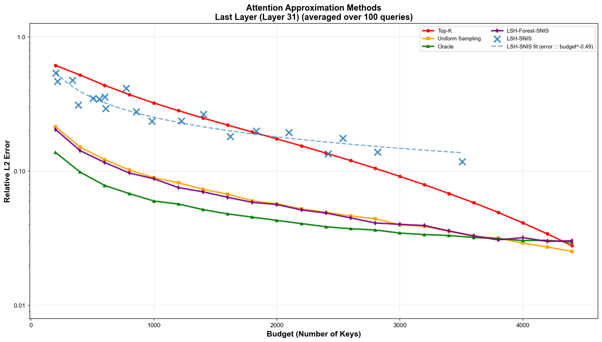

# 🌲 Forest Attention Experiments

**Exploiting LSH-Forest Structure for Sampling-Based Sparse Attention**

---

## 🎯 Overview

This repository contains experiments for tree-structured LSH attention mechanisms. We investigate whether LSH forests can improve sparse attention approximation compared to flat LSH tables, particularly in **diffuse attention regimes** where attention mass is spread across many tokens rather than concentrated on a few.

**Key findings:**
- Static (fixed-depth) LSH forests are mathematically equivalent to flat LSH tables
- Adaptive depth mechanisms (Jungle Backtracking) improve robustness when buckets are empty
- Sampling-based methods with budget control outperform truncation-based approaches (TopK) in diffuse regimes
- Uniform sampling is a surprisingly strong baseline; forest-based SNIS provides consistent but modest improvements

---

## 📁 Repository Structure

```
forest_attention_experiments/
├── data/
│   ├── longbench_v2_truncated_7k_smart.json     # LongBench v2 dataset (503 examples)
│   └── attention_vectors_updated_long.jsonl     # Extracted Q, K, V from Llama-3-8B
├── data_extraction/
│   └── generate_vectors_fixed.py                # Extract attention vectors from transformer
├── experiments/
│   ├── compare.py                               # Main evaluation script
│   ├── methods.py                               # All approximation methods
│   ├── utils.py                                 # Attention computation helpers
│   ├── evaluate_recall_dcg.py                   # Recall/DCG metrics
│   └── visualizations/                          # Plotting scripts
├── results/
│   └── approximation_evaluation/v2/             # Experiment results & plots
└── README.md
```

---

## 🔬 Methods Compared

We evaluate five attention approximation methods:

1. **TopK**: Select top-K keys by logit, compute subset softmax (biased truncation)
2. **Uniform Sampling**: Random uniform sampling from all keys (unbiased baseline)
3. **Oracle Sampling**: Sample from true attention distribution (upper bound, requires full attention)
4. **LSH-SNIS**: Fixed-depth LSH retrieval with self-normalized importance sampling (MagicPIG-style)
5. **prefix_sampling**: Our forest-based method with depth-dependent proposal distribution

All methods target the same key budget for fair comparison.

---

## 🧪 Experimental Setup

### Data Extraction

We extract real Q, K, V vectors from **Llama-3-8B** on long-context examples from LongBench v2:

```bash
cd data_extraction
python generate_vectors_fixed.py
```

**Output:** `attention_vectors_updated_long.jsonl`
- Query (Q), Key (K), Value (V) matrices from first and last attention layers
- All query positions (enables proper causal masking)
- Single head (head 0) to keep file size manageable

### Evaluation Protocol

For each query position:
1. **Compute ground truth**: Full softmax attention over all valid keys (respecting causality)
2. **Test sparse method**: Retrieve/sample fixed budget of keys
3. **Measure L2 error**: `||output_sparse - output_full||_2 / ||output_full||_2`

```bash
cd experiments
python compare.py  # Main comparison
python evaluate_recall_dcg.py  # Additional metrics
```

**Key parameters:**
- Budget: 20-200 keys (vs ~6000 total)
- LSH config: K ∈ {5,6,...,10} depth, L ∈ {10,15,...,40} tables
- prefix_sampling: `min_depth` filtering, `gamma` bucket penalty

---

## 📈 Results



**Figure:** Relative L2 error vs. key budget on Llama-3-8B last layer (mean over 100 queries). Lower is better.

### Key Findings

**1. Uniform sampling outperforms TopK at low/moderate budgets**
- In diffuse attention regimes (where logits are similar), TopK suffers from "missing mass" bias
- Subset softmax renormalization over truncated keys systematically underestimates diffuse tail
- Uniform sampling avoids this bias and remains competitive

**2. prefix_sampling (forest-based SNIS) improves over uniform**
- Consistent ~5-15% error reduction across budgets
- Achieves this by biasing sampling toward more similar keys while maintaining near-uniform exploration
- Depth-dependent proposal: shallow buckets (near-uniform) + deeper buckets (similarity-biased)

**3. Fixed-depth LSH-SNIS is unstable**
- Retrieved set size varies wildly with (K, L) configuration and query
- Difficult to control computational budget
- Motivates explicit budgeted sampling via forest hierarchy

**4. Oracle sampling sets the performance ceiling**
- Shows that importance sampling can approach optimal performance even at small budgets
- Gap between uniform and oracle indicates room for better proposal distributions

---

## 🌲 Why Forests?

### Static Trees Are Equivalent to Flat Tables

When retrieval depth is **fixed** at K bits, an LSH forest provides no advantage over flat hash tables:
- Keys are selected by K-bit prefix match
- Deeper structure (K+1, K+2, ... bits) is ignored
- Importance weights depend only on retrieval policy, not post-hoc depth

### Jungle Backtracking: Adaptive Depth

Allowing **dynamic depth** enables practical gains:
- If depth-K bucket is empty → backtrack to depth K-1
- Prevents "missing mass" failures when K-bit collision probability is low
- Creates superposition of high-precision (depth K) and high-recall (depth K-1) schemes

### prefix_sampling: Depth-Dependent Proposals

Instead of returning all keys at fixed depth, **sample** from forest hierarchy:
- Each sample: choose tree → choose depth d from ρ(d|q) → sample key uniformly from bucket
- Marginal proposal π_i(q) aggregates across depths and trees
- Apply SNIS to correct for proposal-target mismatch
- **Benefit:** Explicit budget control + exploits multi-resolution structure

---

## 🚀 Next Steps

### 1. Downstream Task Evaluation ⏭️
Current metrics focus on **attention output L2 error**, which measures numerical approximation quality but doesn't directly test generation quality.

**Planned:**
- Integrate sparse attention into full Llama-3-8B model
- Evaluate on **LongBench v2 benchmark tasks**:
  - Multiple-choice QA accuracy
  - Generation quality (BLEU, ROUGE)
  - Perplexity on long contexts
- Test whether better attention approximation → better task performance
- Validate whether `min_depth` filtering preferentially samples semantically important keys

### 2. Adaptive Proposal Distributions
- Learn or adapt ρ(d|q) per query/head to maximize effective sample size
- Stratified sampling: guarantee both coarse and fine coverage under fixed budget
- Query-dependent depth allocation

### 3. Multi-Head and Multi-Model Extension
- Currently tested on single head (head 0)—extend to all attention heads
- Test on other architectures: Llama-2, Mistral, Qwen
- Analyze variation in attention patterns across heads/layers

---

## 🛠️ Getting Started

### Setup

```bash
conda create -n forest python=3.10
conda activate forest
pip install -r requirements.txt
```

### Run Experiments

```bash
# Extract attention vectors (requires GPU, ~1 hour for 11 examples)
cd data_extraction
python generate_vectors_fixed.py

# Run method comparison (CPU-friendly, ~10 min)
cd experiments
python compare.py

# Evaluate retrieval metrics
python evaluate_recall_dcg.py

# Generate plots
cd visualizations
python plot_recall_dcg_clean.py
```

Results saved to `results/approximation_evaluation/v2/`

---

## 📊 Implementation Details

### prefix_sampling Configuration

**Best configuration (last layer):**
```python
L = 50              # Number of LSH trees
K_MAX = 30          # Maximum hash depth
MIN_DEPTH = 2       # Filter keys with max_depth < 2
GAMMA = 1.0         # Bucket size penalty: ρ(d) ∝ (avg_bucket_size)^γ
TAU = 0.0           # No smoothing
```

**Computing π_i(q) efficiently:**
- Store full K_MAX-bit hash codes for all keys
- At query time: traverse query path to get bucket sizes c_ℓ,d(q)
- For sampled key i: compute longest common prefix (LCP) with query in each tree
- Sum contribution: π_i(q) = Σ_ℓ Σ_{d≤LCP_ℓ(q,i)} (1/L) · ρ(d|q) · 1/c_ℓ,d(q)
- Only computed for sampled keys—no dependence on N

### LSH-SNIS Baseline

```python
K = 8               # Fixed hash depth
L = 20              # Number of tables
MIN_HITS = 2        # Require ≥2 table matches
```

Retrieves variable-size candidate set; we sweep (K, L) grid and plot by average retrieved count.

---

## 📚 Related Work

This work builds on:
- **MagicPIG** (Chen et al., 2024): LSH-based SNIS for sparse attention in diffuse regimes
- **LSH Forests** (Bawa et al., 2005): Tree-structured LSH for approximate nearest neighbors
- **FlashAttention** (Dao et al., 2022): Exact attention with reduced memory traffic
- **ANNA** (Approximate Nearest Neighbor Attention): ANN-based attention mechanisms

Key insight: Attention approximation differs from standard ANN due to:
- Query-key distribution shift during generation
- Positional encodings create non-stationary similarity
- Diffuse attention mass requires importance sampling, not hard truncation

---

## 📝 Citation

```bibtex
@misc{forest_attention_2025,
  title={Forest Attention: Exploiting LSH-Forest Structure for Sampling-Based Sparse Attention},
  author={[Authors]},
  year={2025},
  note={Code: \url{https://github.com/[your-repo]}}
}
```

---

**Last Updated:** December 21, 2024  
**Status:** Attention L2 error evaluation complete; downstream task evaluation next
